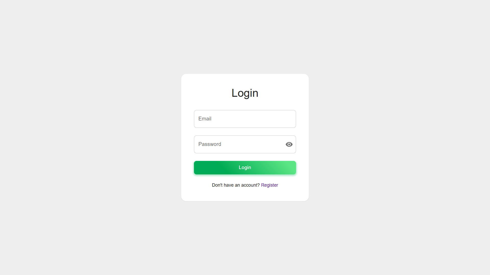
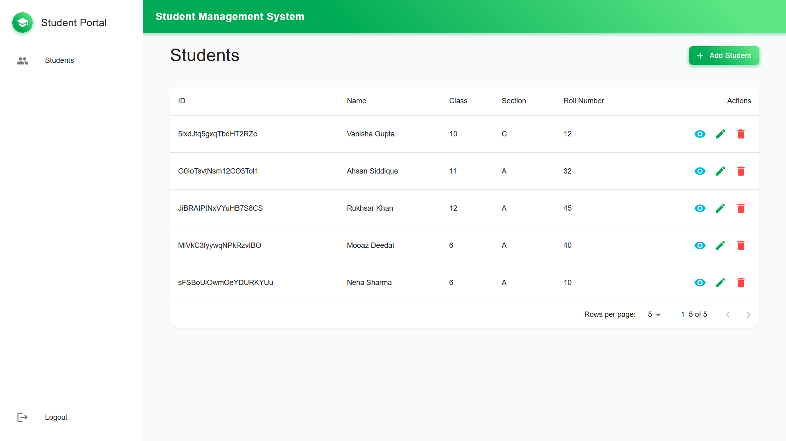

# Student Management System

This project is a React-based application for managing student information. It allows users to add, edit, and delete student records, as well as view a list of all students.

## Features

- Add new student records
- Edit existing student records
- Delete student records
- View a list of all students
- firebase authentiation ( login, logout, sign-up functionality)

## Installation

1. Clone the repository:
   ```bash
   git clone https://github.com/Rukhsarkh/student-react-app-assignment.git
   ```
2. Navigate to the project directory:
   ```bash
   cd student-management
   ```
3. Install the dependencies:
   ```bash
   npm install
   ```
4. Start the development server:
   ```bash
   npm run dev
   ```

## Screenshots

### Login



### Home Page



### Add Student


### Edit Student


### Student List


## Technologies Used

- React
- JavaScript
- CSS
- Firebase
- HTML
- Node.js
- Webpack
- Babel
